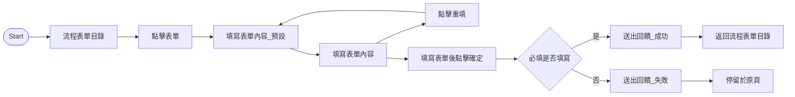

# 功能流程規格表格式

每個「次要功能」對應一張表。本文件定義**完整格式**與**填寫規則**，並附上範例。

## 表格結構

以兩欄表格呈現，左欄為欄位名稱，右欄為內容：

```markdown
## <功能名稱>

| 項目 | 內容 |
|---|---|
| **連結** | <Figma 連結或設計稿 URL> |
| **流程說明** | <一句話描述此功能的目的> |
| **流程起點** | <使用者從哪裡開始、做什麼動作觸發此流程> |
| **適用對象與場景** | <哪些角色 / 何種情境使用> |
| **流程圖** | <Mermaid flowchart，見 flow-diagram.md> |
| **雛形** | <畫面截圖引用，例：見圖1、圖2> |
| **功能及欄位說明** | <依子區塊列出，見下方「欄位說明格式」> |
| **API 規格** | <列出此流程涉及的 API，見下方「API 規格格式」> |
| **驗收條件** | <AC 列表，Given-When-Then 或條列式> |
| **錯誤處理** | <錯誤情境與錯誤文案> |
```

## 欄位說明格式

採四段式：**格式 / 必填 / 預設值 / 處理邏輯**。每個畫面區塊（例：表單、目錄、選擇器）獨立一組欄位清單。

```
表單內容，以「請假申請」為例 (見圖2, 3)

1. 申請人
   - 格式：英文名 中文姓(工號)，例：Alex 王小明(AB000)
   - 必填：是
   - 預設值：申請人等於填單人(本人)
   - 處理邏輯：僅可以選單選取人員，不可手動輸入；勾選「代人申請」後清空申請人欄位；取消勾選「代人申請」則恢復預設值

2. 請假開始時間、請假結束時間
   - 格式：YYYY/MM/DD；hh:mm
   - 必填：是
   - 預設值：無
   - 處理邏輯：結束時間必須晚於開始時間

3. 共計
   - 格式：數字至小數點第一位，例：8.0
   - 必填：是
   - 預設值：無
   - 處理邏輯：待選擇完請假開始及結束時間後，系統自動換算，不可手動輸入

4. 附件清單
   - 格式：上傳檔案後顯示附件列表，格式含檔案名稱+副檔名、上傳時間 YYYY/MM/DD hh:mm
   - 必填：否
   - 預設值：空狀態
   - 處理邏輯：支援 JPG, PNG, Docx 等格式，單份檔案不超過 10MB
```

### 欄位類型對應規則

| 欄位類型 | 必填提示 | 範例 |
|---|---|---|
| 輸入框（Input） | 格式、字元上限 | 預設值：請輸入請假理由 |
| 選擇器（Select） | 選項來源 | 預設值：選單第一個項目 |
| 日期/時間 | `YYYY/MM/DD` 或 `YYYY/MM/DD hh:mm` | 預設值：無 / 今日 |
| 數字 | 小數位數、範圍 | 格式：數字至小數點第一位 |
| 檔案上傳 | 格式、大小 | 支援 JPG, PNG, Docx，單份不超過 10MB |
| 按鈕 | 位置、啟用條件 | 凍結於底部；點擊重填回復預設值 |
| Toast / 回饋 | 觸發條件、停留時間 | 於 10 秒後自動消失，可手動關閉 |

## API 規格格式

若後端 API 已知或可推斷，列出：

```markdown
**API 規格**

| Method | Endpoint | 說明 |
|---|---|---|
| GET | `/api/forms/leave` | 取得請假表單預設值（假別選項、職務代理人列表） |
| POST | `/api/forms/leave` | 送出請假申請 |

### POST /api/forms/leave

**Request Body**

```json
{
  "applicantId": "AB000",
  "proxyId": "CD001",
  "leaveType": "annual",
  "startTime": "2026/04/26 09:00",
  "endTime": "2026/04/26 18:00",
  "hours": 8.0,
  "reason": "家族旅遊",
  "attachments": ["file_id_1", "file_id_2"]
}
```

**Response**

- `200 OK`：`{ "applicationId": "LA202604260001" }`
- `400 Bad Request`：欄位驗證失敗
- `500 Internal Server Error`：系統錯誤
```

若 API 尚未確認，標註 `【待確認：API 規格】` 即可，不要自行假設。

## 驗收條件格式

全篇保持同一種格式（Given-When-Then 或條列式擇一）。

### Given-When-Then 範例

```
**驗收條件**

- AC1 申請人預設為本人
  - Given 使用者為正職員工已登入
    When 進入請假申請表單
    Then 申請人欄位自動帶入「<本人> 英文名 中文姓(工號)」

- AC2 勾選代人申請清空申請人
  - Given 申請人欄位預設為本人
    When 使用者勾選「代人申請」
    Then 申請人欄位清空，可重新選擇人員
    And  取消勾選後恢復為本人

- AC3 送出成功回饋
  - Given 所有必填欄位皆已填寫
    When 點擊送出
    Then 顯示綠色 Toast「申請成功！已進入審核流程」
    And  10 秒後 Toast 自動消失
```

### 條列式範例

```
**驗收條件**

- [ ] 申請人預設為本人，格式「Alex 王小明(AB000)」
- [ ] 必填欄位未填時，送出按鈕 disabled
- [ ] 共計時數在選完起訖時間後自動計算，不可手動輸入
- [ ] 送出成功顯示綠色 Toast，10 秒後自動消失
- [ ] 送出失敗顯示紅色 Toast「請檢查內容或稍後再試」
- [ ] 附件支援 JPG/PNG/Docx，單檔不超過 10MB
```

## 錯誤處理格式

```
**錯誤處理**

於該欄位下方顯示錯誤提示：

- 若為輸入框，格式為「請輸入 + 欄位名稱」（例：請輸入請假理由）
- 若為選擇器，格式為「請選擇 + 欄位名稱」（例：請選擇職務代理人）
- 跨欄位驗證錯誤（例：結束時間早於開始時間）顯示在該組欄位下方，文案自訂

**Toast 失敗回饋**

- 送出失敗時顯示紅色 Toast「請檢查內容或稍後再試」
- Toast 停留 10 秒後自動消失，亦可手動關閉
```

## 完整範例：「填寫流程表單」

```markdown
## 填寫流程表單

| 項目 | 內容 |
|---|---|
| **連結** | [Figma 連結](https://figma.com/file/xxxx) |
| **流程說明** | 員工填寫流程表單並進入審批流程 |
| **流程起點** | 員工進入「流程表單目錄」，選擇欲填寫表單，填寫完畢並點擊「確定」 |
| **適用對象與場景** | 全體正職員工；適用所有流程表單 |

### 流程圖



### 雛形

- 圖1 流程表單目錄
- 圖2 以請假申請為例，表單預設狀態(左)；填寫狀態(右)
- 圖3 人員選擇器
- 圖4 送出回饋

### 功能及欄位說明

**流程表單目錄 (見圖1)**

1. 最近使用表單
   - 處理邏輯：跟隨帳號，顯示最近使用的十筆表單；由上至下依照使用時間近到遠排序

2. 目錄單元
   - 處理邏輯：頁面顯示內容需設定最大寬度，目錄單元置中於頁面，每單元寬度為顯示內容寬度平均

**表單內容，以「請假申請」為例 (見圖2, 3)**

1. 申請人
   - 格式：英文名 中文姓(工號)，例：Alex 王小明(AB000)
   - 必填：是
   - 預設值：申請人等於填單人(本人)
   - 處理邏輯：僅可以選單選取人員，不可手動輸入；勾選「代人申請」後清空申請人欄位

（以下略……依參考模板延伸）

### API 規格

【待確認：API 規格】

### 驗收條件

- [ ] 申請人預設為本人
- [ ] 必填欄位未填時送出按鈕 disabled
- [ ] 送出成功顯示綠色 Toast「申請成功！已進入審核流程」
- [ ] 送出失敗顯示紅色 Toast「請檢查內容或稍後再試」

### 錯誤處理

- 輸入框錯誤：「請輸入 + 欄位名稱」
- 選擇器錯誤：「請選擇 + 欄位名稱」
```
